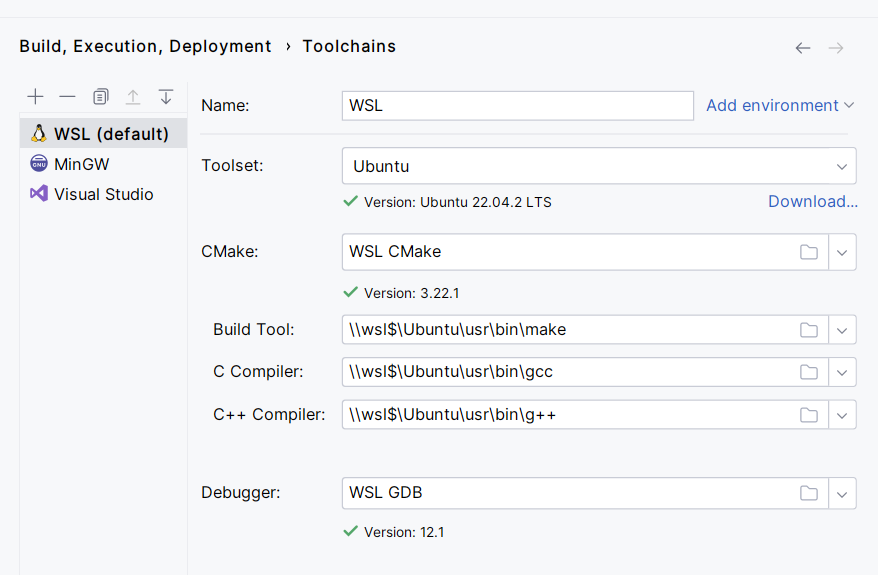
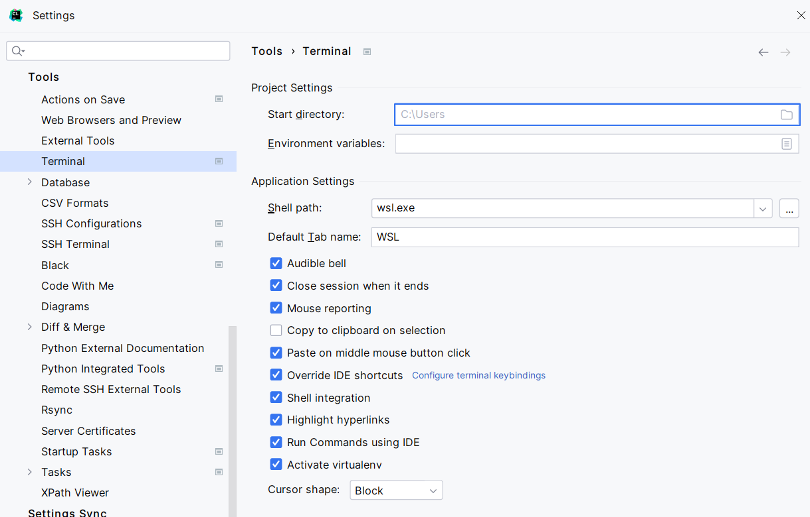
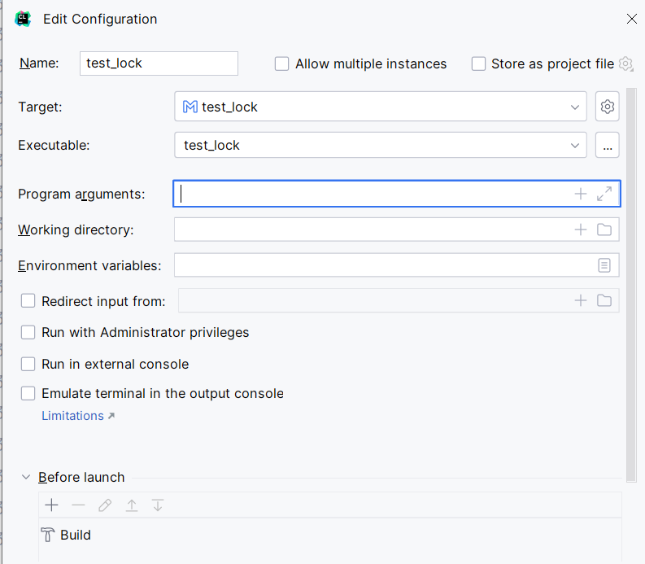
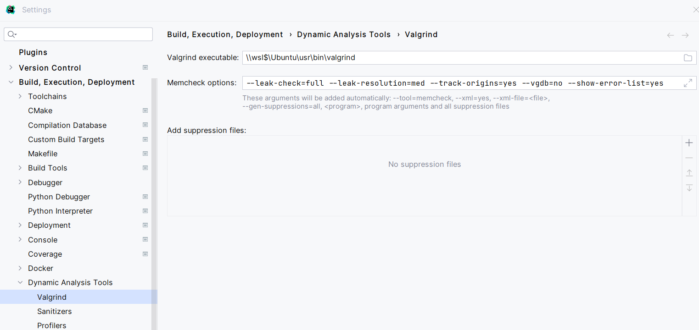

# Using CLion with WSL

Here's the guide on how to use CLion with WSL. This allows CLion to be fully integrated with a Linux environment, which allows you to have full IDE features with Linux libraries. If you used to SSH into Linux servers all the time and had to edit `.c` files on a text editor, this should fix everything.

Keep this in mind: You will be editing your files on Windows, so none of your code will be stored on the Linux subsystem. However, the code will be *run* on the Linux subsystem, and the compiler is on the Linux subsystem.

## Installing WSL

[Install WSL](https://learn.microsoft.com/en-us/windows/wsl/install). It's best to use the default Linux distribution, which is Ubuntu.

Summarizing the article, all you need to do is run

```powershell
wsl --install
```

in Window's command prompt and reboot your computer. You need to enable virtualization in your BIOS settings, which is dependent on your computer so Google `enable virtualization on BIOS` or something like that.

After that, once you've installed WSL, on your start menu search "Ubuntu" and click the app. It should open up a terminal, which is the Linux terminal.

Your Linux stuff is stored somewhere on your hard drive -- to open it up in Windows explorer, just type `explorer.exe .` in the Linux shell.

## Downloading all libraries

WSL's version of Linux does not come with Linux. For most Linux commands to work, you'll need to install them. I typically run, in Linux:

```
sudo apt-get install build-essential
```

You definitely need these: run `sudo apt-get install <library name>`

```
cmake
gcc
g++
valgrind
gdb
```

Try not to install the version that results in security vunerabilities.

This may not be the entire list. Don't worry about downloading the same thing twice as doing so will just check for updates.

## Configuring WSL with CLion

You probably have WSL 2 installed if you followed my steps the time I wrote this article.

[Follow this guide](https://www.jetbrains.com/help/clion/how-to-use-wsl-development-environment-in-product.html#wsl-tooclhain). Namely, complete **Configure a WSL toolchain for your project.**



To access this, go to File > Settings > Build, Execution, Deployment > Toolchains, click on `+` and select WSL, then **drag it up.** Then, ensure that your fields match those in the screenshot. We'll be using **gcc** and **g++** as the C compiler.

You should copy-paste these:

- Build Tool: `\\wsl$\Ubuntu\usr\bin\make`
- C Compiler: `\\wsl$\Ubuntu\usr\bin\gcc`
- C++ Compiler: `\\wsl$\Ubuntu\usr\bin\g++`

Don't use the automated ones; it will not work.

You **must** also set the default terminal to WSL, otherwise you may experience issues with Makefile projects:



Located in Settings > Tools > Terminal. Namely, set Shell path to `wsl.exe`

## Compiling and Running Makefile projects

This assumes that you already have a makefile project, and you just want to open it with CLion. Creating new Makefile projects is not in the scope of this document. 

[Read through this](https://www.jetbrains.com/help/clion/makefiles-support.html). All steps up to `WSL specifics` is useful, but note that you can run projects in the top right of the IDE, where you would run on any JetBrains IDE.

Beware a possibly ambiguous step: On step 4, "You'll be prompted to clean the project": Just keep *Make target to run* as `clean`.

All targets can be seen as a possible run configuration ([see here](https://www.jetbrains.com/help/clion/makefiles-support.html#rd-configs)).

When you run a configuration for the first time, you will be prompted to state an executable for it. Just type in the name of your executable. Initially, the Executable field will be blank.



CLion's debugger works exactly as you would expect it to run.

## Valgrind

You must have Valgrind installed on your Linux distribution. Then, set *Valgrind executable* to this in Settings > Build, Execution, Deployment > Dynamic Analysis Tools > Valgrind:



You don't need all the Memcheck options; these are my personal preferences.

Copy-paste: `\\wsl$\Ubuntu\usr\bin\valgrind`

If you don't do this, you may get permission errors when you try to run Valgrind memcheck.
